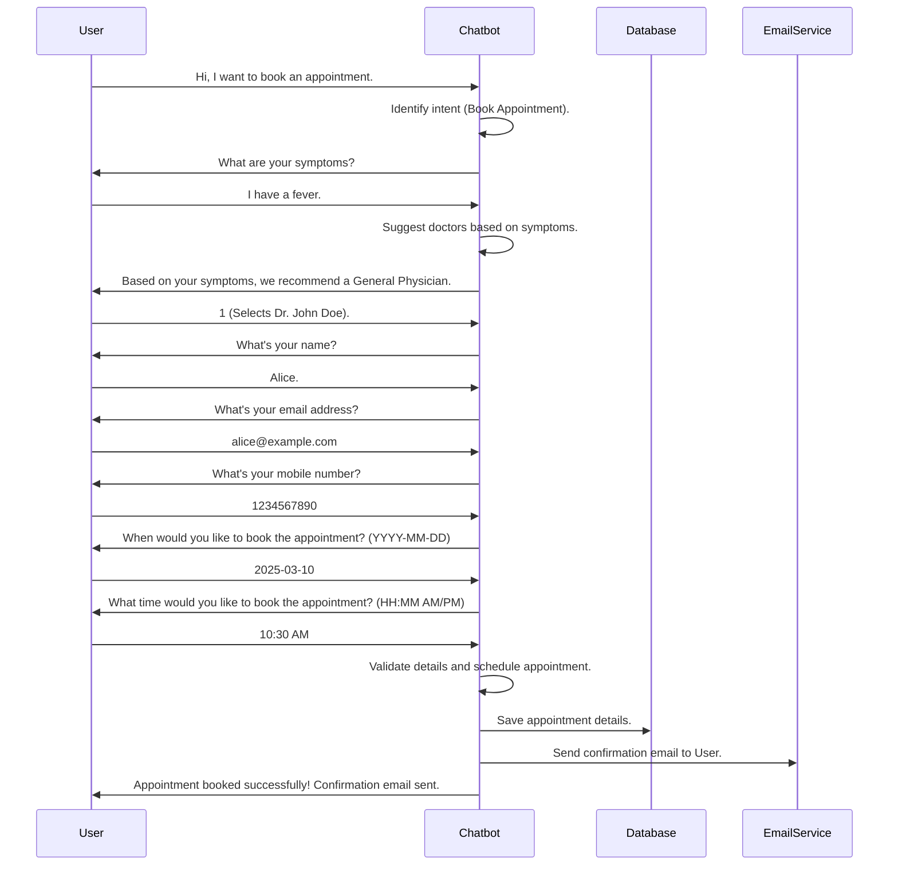

# Doctor Appointment Chatbot
[](https://opensource.org/licenses/MIT)  <!-- Replace with your actual license badge link and license -->

This project is a Doctor Appointment Chatbot that allows users to book, reschedule, and cancel doctor appointments based on their symptoms through a chat interface. After booking, users receive a confirmation email.

## Features

- Chat-based interaction to manage doctor appointments
- Suggests doctors based on user symptoms
- Confirms appointment booking via email
- Reschedules and cancels appointments

## Requirements

To install the necessary dependencies, follow these steps:

1.  **Create a `requirements.txt` file:** In the root directory of the project, create a new text file named `requirements.txt`.

2.  **Add the dependencies:** Open `requirements.txt` in a text editor and paste the following dependencies into it:

    ```
    smtplib
    datetime
    email
    pandas
    random
    re
    os
    difflib
    streamlit
    kagglehub
    ```
    **(Optional: Pin specific versions for more consistent behavior.  Example: `pandas==1.5.0`)**

3.  **Install the dependencies:** Open a terminal or command prompt, navigate to the project directory, and run the following command:

    ```bash
    pip install -r requirements.txt
    ```

## Usage

1. Clone the repository:
   ```bash
   git clone https://github.com/MVivekananda/Doctor_Appointment_Chatbot.git  **(Double-check that this is the correct repository URL. Should it be Doctor_Appointment_Chatbot?)**
   cd Doctor_Appointment_Chatbot

2. Run the Streamlit application:
   ```bash
   streamlit run infosys.py
   ```
   This command will start the Streamlit application, which hosts the chatbot. `infosys.py` is the main script that contains the chatbot's logic and interface.

3. Interact with the chatbot to book, reschedule, or cancel doctor appointments.

## Appointment Booking Workflow

1. **Start Chat**: User initiates the chat.
2. **Symptom Input**: User enters their symptoms.
3. **Doctor Suggestion**: Bot suggests doctors based on symptoms.
4. **Doctor Selection**: User selects a doctor.
5. **Appointment Details**: User provides details like name, email, mobile number, date, and time.
6. **Confirmation**: Bot confirms the appointment and sends a confirmation email to the user. **(Appointment booking successful if all the above steps are correct and complete, or else it fails)**

## Example

1. **Start Chat**:
   ```
   User: Hi, I want to book an appointment.
   Bot: Welcome to the Hospital Appointment System! How can I assist you today?
   ```

2. **Symptom Input**:
   ```
   User: I have a fever.
   Bot: Based on your symptoms, we recommend a General Physician.
   ```

3. **Doctor Selection**:
   ```
   Bot: Here are the available doctors:
   1. Dr. John Doe
   2. Dr. Jane Smith
   User: 1
   ```

4. **Appointment Details**:
   ```
   Bot: What's your name?
   User: Alice
   Bot: What's your email address?
   User: alice@example.com
   Bot: What's your mobile number?
   User: 1234567890
   Bot: When would you like to book the appointment? (YYYY-MM-DD)
   User: 2025-03-10
   Bot: What time would you like to book the appointment? (HH:MM AM/PM)
   User: 10:30 AM
   ```

5.  KaggleHub credits the data that are used to train the ML model is from 100k Health Records and Report:
    This dataset contains over 100,000 health records and reports, providing a comprehensive view of patient information and medical history.

6.  **Confirmation**:
    ```
    Bot: Appointment booked successfully! Confirmation email sent.
    ```
    **Note: These are example interactions. The chatbot's responses are primarily scripted and may not handle all possible inputs. Also the appointment booking system is not connected to real EHR. It is trained with 100k Health Records and Reports data that are found in KaggleHub. It is credited under MIT License.**

## License

This project is licensed under the MIT License. See the [LICENSE](LICENSE) file for details. **(Remember to create a `LICENSE` file in your repository!)**
Here's a UML diagram explaining Doctor Appointment Chatbot:

## Live Demo

Try out the SayDoc Doctor Appointment Chatbot live at: [https://saydoc-appointment-chatbot.streamlit.app/](https://saydoc-appointment-chatbot.streamlit.app/)

##
